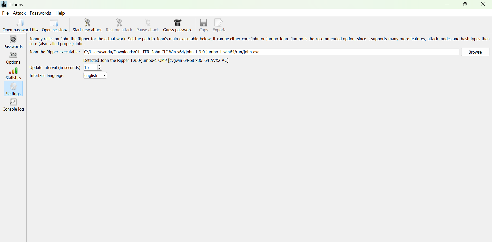
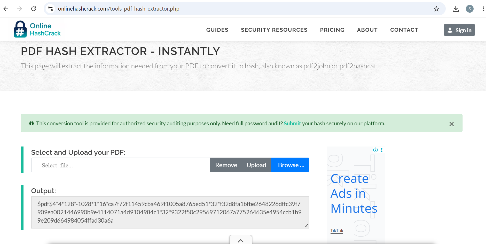
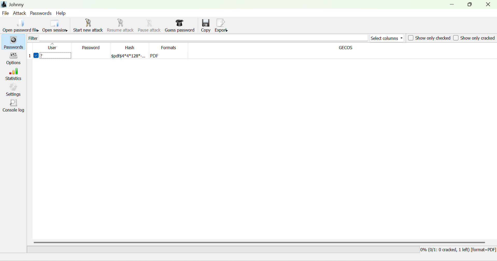
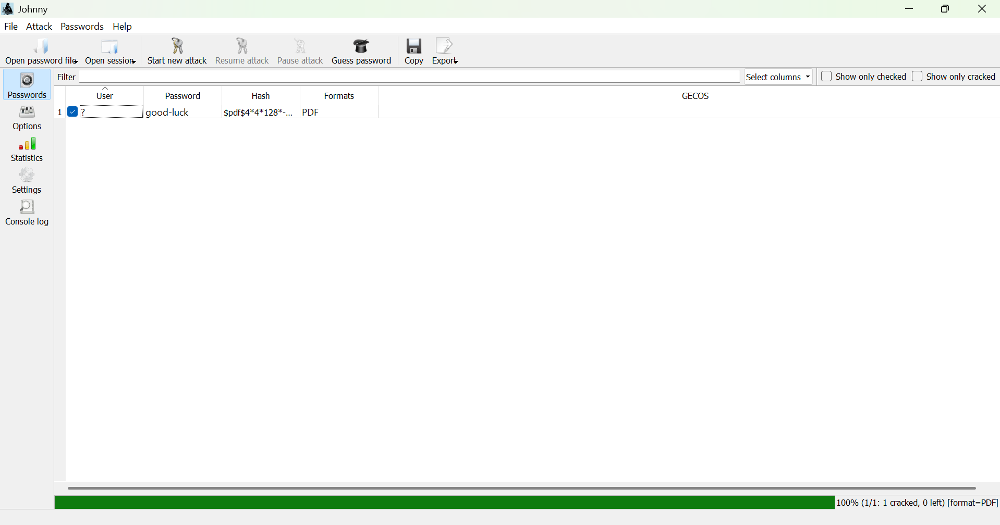
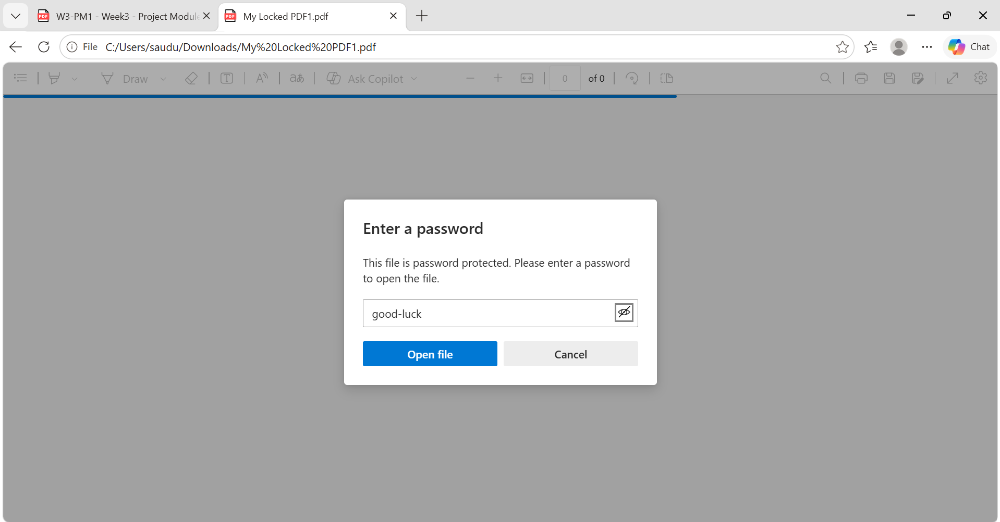
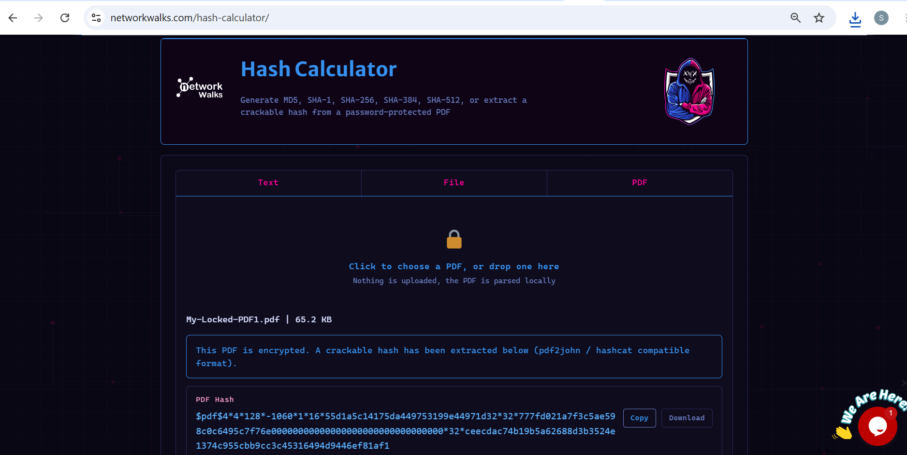
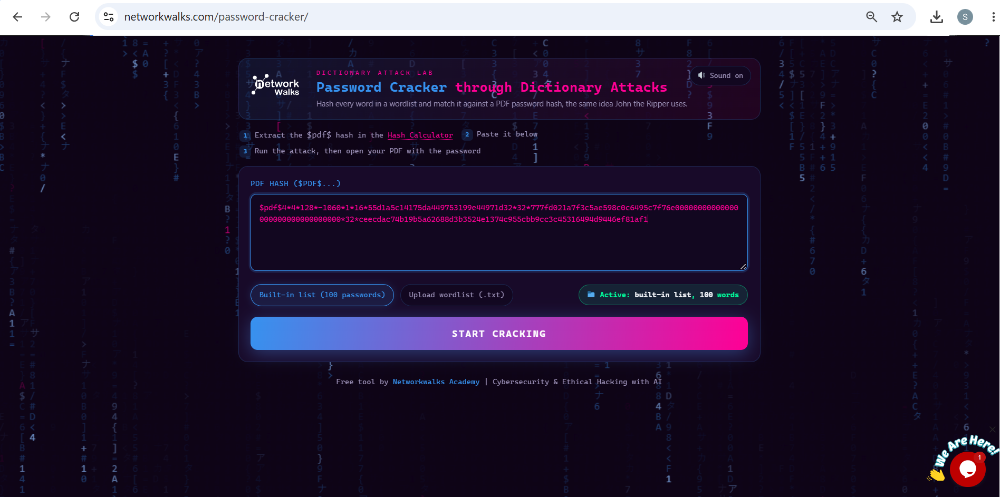
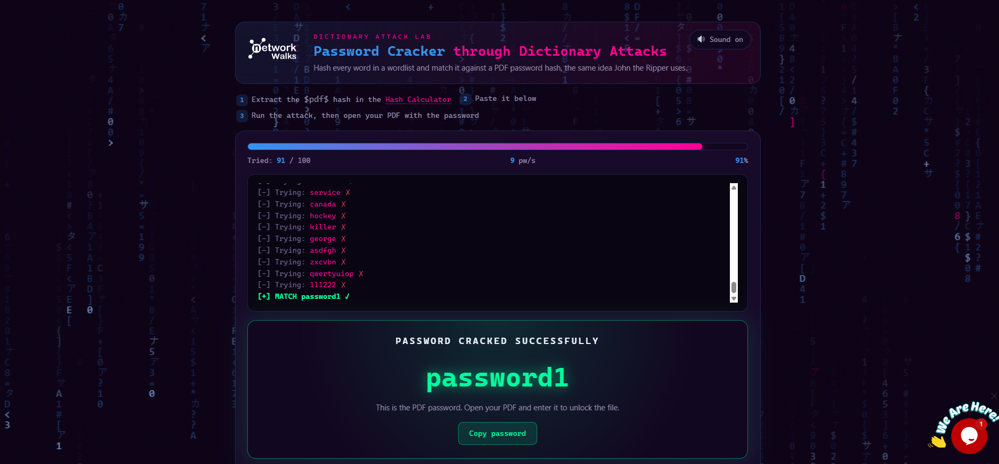
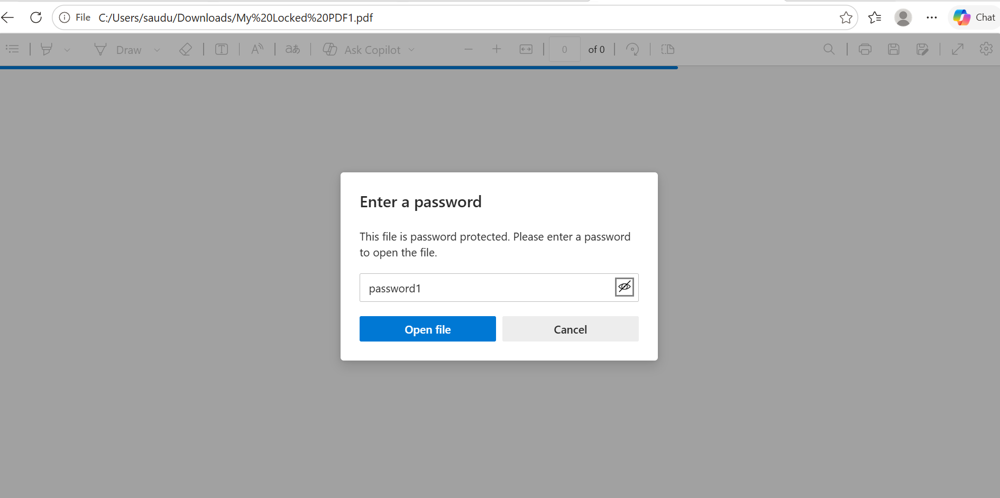
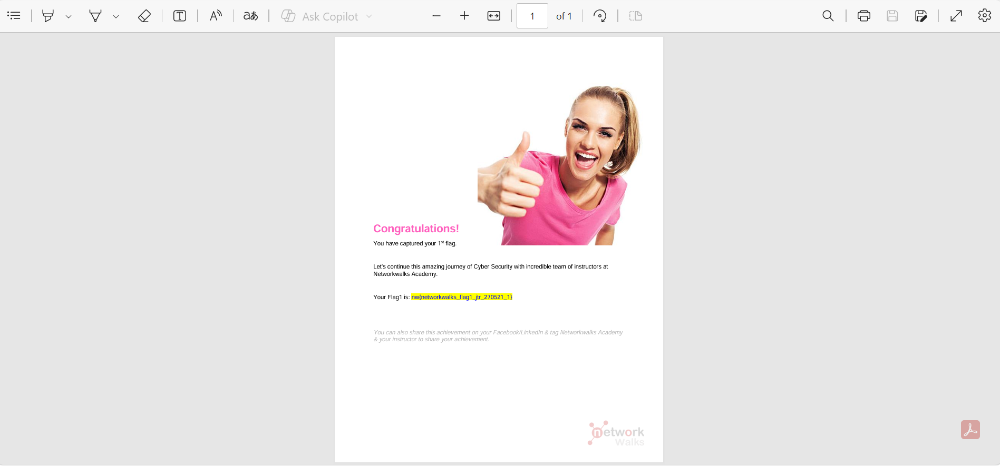

# 🔎 Cybersecurity Internship — Password Cracking Labs

Personal lab notes from my cybersecurity internship, covering hands-on password auditing and hash-cracking exercises.

> ⚠️ All work below was carried out on files/systems I was explicitly authorized to test, inside a supervised training environment.

---

## 🧭 At a Glance

| | |
|---|---|
| **Intern** | Saud Ur Rehman Abbasi |
| **Program** | Networkwalks |
| **Mentor** | Waqas Karim (CCIE) |
| **Week** | 3 |
| **Focus Area** | Password cracking & hash analysis |
| **Labs Completed** | 2 |

---

## 🗂️ Labs

<b>Lab 1 — John the Ripper + Johnny GUI</b>

**Goal:** Recover the password on a protected PDF using John the Ripper and its GUI front-end, Johnny.

**Tools:**
- John the Ripper
- Johnny GUI
- PDF hash extractor

**Steps:**
1. Downloaded and extracted John the Ripper.
2. Installed Johnny GUI and pointed it at `john.exe`.
3. Extracted the PDF's password hash and saved it to `hash.txt`.
4. Loaded the hash into Johnny.
5. Ran a dictionary attack.

**Outcome:** `good-luck`

<b>Lab 2 — Networkwalks Online Tools</b>

**Goal:** Recover the password on a protected PDF using Networkwalks' online hash calculator and password cracker.

**Tools:**
- Networkwalks Hash Calculator
- Networkwalks Password Cracker

**Steps:**
1. Uploaded the PDF to the Hash Calculator and generated its hash.
2. Copied the hash into the Password Cracker.
3. Ran the built-in dictionary attack.

**Outcome:** `password1`

---

## 🖼️ Evidence

<b>Lab 1 — JTR + Johnny screenshots</b>

**Johnny configured**

**Hash extracted from PDF**

**Hash loaded into Johnny**

**Password cracked**

**PDF before unlocking**

**PDF after unlocking**

<b>Lab 2 — Networkwalks Tools screenshots</b>

**Hash Calculator**

**Password Cracker**

**Password cracked**

**PDF before unlocking**

**PDF after unlocking**

---

## 🏁 Flags

| Lab | Flag |
|---|---|
| Lab 1 — JTR + Johnny | nw{cybersecurity_flag_captured_2608} |
| Lab 2 — Networkwalks Tools | nw{networkwalks_flag1_jtr_270521_1} |

---

## 💡 Takeaways

**Hashing vs. Encryption**
Hashing is a one-way transformation — it turns data into a fixed-length value that can't be reversed back to the original. Encryption is two-way: anything encrypted can be decrypted again with the right key. This distinction matters for password storage, since passwords should be hashed, not encrypted.

**Why weak passwords fail**
Both labs cracked their target passwords (`good-luck`, `password1`) using a simple dictionary attack — trying words from a predefined wordlist rather than brute-forcing every combination. Predictable, common, or short passwords fall to this kind of attack almost immediately.

**What good password hygiene looks like**
- [ ] Long, unique passphrases
- [ ] Mixed case, numbers, symbols
- [ ] No reuse across accounts
- [ ] MFA enabled wherever possible
- [ ] Managed via a password manager

---

## 📎 Resources

| Resource | Link |
|---|---|
| John the Ripper | https://www.openwall.com/john/ |
| Johnny GUI | https://openwall.info/wiki/john/johnny |
| Networkwalks | https://networkwalks.com/ |

---

## ⚖️ Disclaimer

This repository documents training exercises performed only against authorized files and systems as part of a supervised cybersecurity internship. Do not attempt password cracking or hash analysis against systems you do not own or have explicit permission to test.
